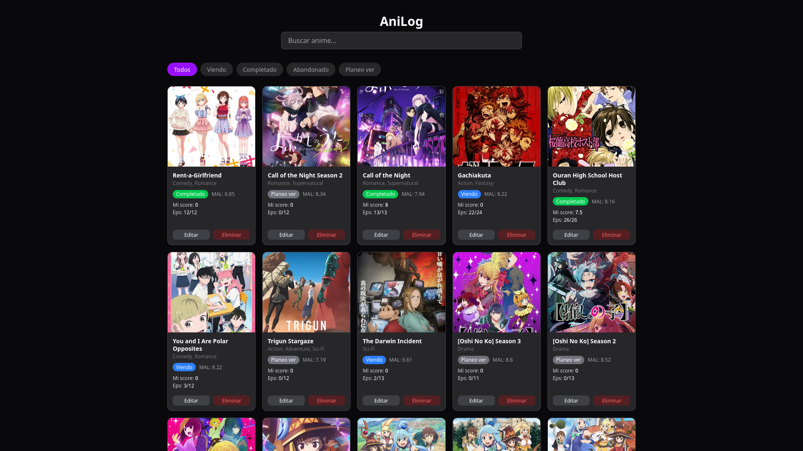
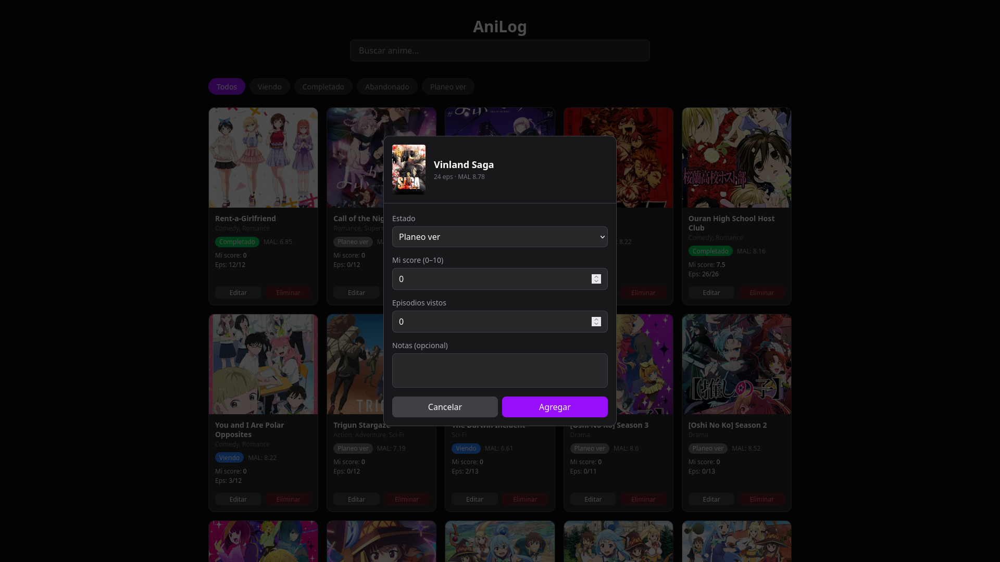
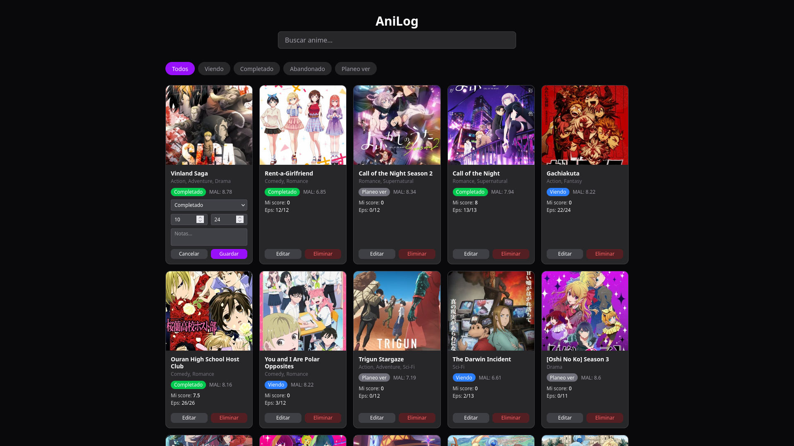

# AniLog

Aplicación web para llevar un historial personal de animes. Buscá animes via MyAnimeList, agregálos a tu lista con tu score y estado, y editá tu progreso.

## Screenshots





## Tech Stack

| Capa | Tecnología |
|---|---|
| Backend | ASP.NET Core 8 Web API |
| ORM | Entity Framework Core 8 |
| Base de datos | PostgreSQL |
| API externa | Jikan v4 (MyAnimeList) |
| Frontend | React + Vite |
| Estilos | Tailwind CSS |

## Requisitos

- .NET 8 SDK + ASP.NET Core runtime 8
- PostgreSQL
- Node.js 18+

## Cómo correr el proyecto

### Backend

```bash
cd AniLog.API
```

Editá `appsettings.json` con tu password de PostgreSQL:
```json
"DefaultConnection": "Host=localhost;Database=anilog_db;Username=postgres;Password=TU_PASSWORD"
```

```bash
dotnet ef database update
dotnet run
# API en http://localhost:5224
# Swagger en http://localhost:5224/swagger
```

### Frontend

```bash
cd AniLog.Frontend
npm install
npm run dev
# App en http://localhost:5173
```

## Endpoints de la API

| Método | Ruta | Descripción |
|---|---|---|
| GET | `/api/search?q=naruto` | Busca animes en Jikan API |
| GET | `/api/anime` | Lista el historial completo |
| GET | `/api/anime?status=watching` | Filtra por estado |
| GET | `/api/anime/{id}` | Detalle de una entrada |
| POST | `/api/anime` | Agrega un anime al historial |
| PUT | `/api/anime/{id}` | Actualiza progreso, score o notas |
| DELETE | `/api/anime/{id}` | Elimina del historial |

## Arquitectura

```
AniLog.API/
├── Controllers/   # SearchController, AnimeController
├── Services/      # JikanService (Jikan API), AnimeLogService (lógica CRUD)
├── DTOs/          # AddAnimeDto, UpdateAnimeDto, AnimeResponseDto, SearchResultDto
├── Models/        # AnimeLog (entidad DB), AnimeStatus (enum)
└── Data/          # AppDbContext

AniLog.Frontend/
├── src/
│   ├── components/  # SearchBar, AnimeList, AnimeCard, AddAnimeModal
│   └── services/    # api.js (todas las llamadas al backend)
```

El flujo principal: el usuario busca un anime → selecciona uno → completa el modal con su status/score → se guarda en PostgreSQL combinando los datos de Jikan con los datos del usuario.
